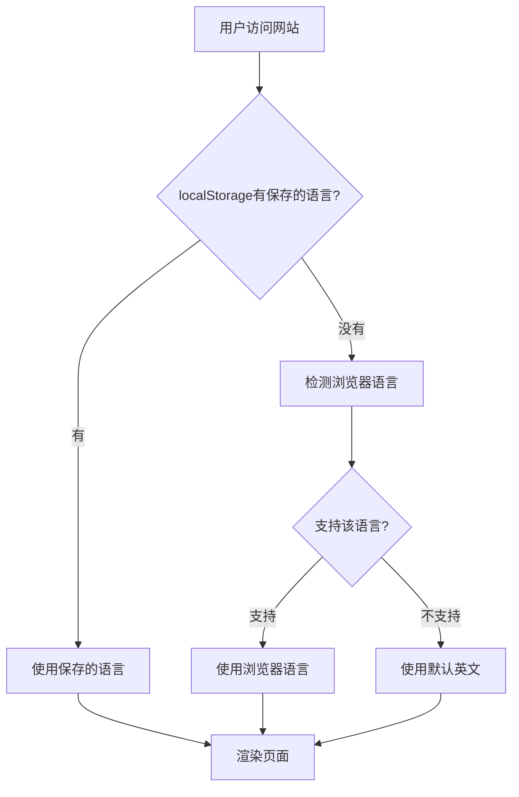
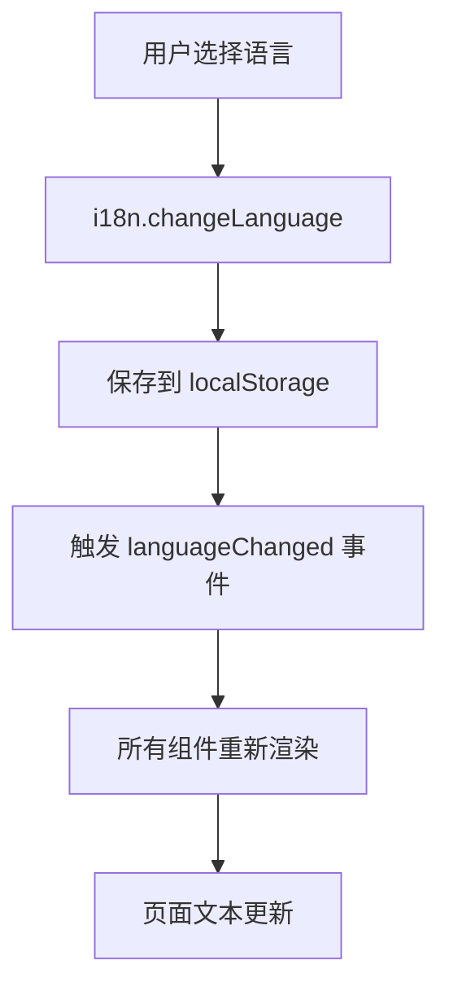

# 🌐 多语言系统完善指南

## 更新内容

已完成全面的多语言系统改造，解决了之前的所有问题。

## ✅ 已解决的问题

### 1. 默认语言设置
- ✅ **默认语言已改为英文** (`defaultLang = 'en'`)
- ✅ 所有新用户首次访问将看到英文界面

### 2. 智能语言检测
- ✅ **浏览器语言自动检测**：根据 `navigator.language` 自动设置
- ✅ **语言映射**：支持各种语言变体（如 en-US, en-GB → en）
- ✅ **检测优先级**：
  1. 用户手动选择的语言（localStorage）
  2. 浏览器语言设置
  3. 默认英文

### 3. 统一语言状态
- ✅ **全局 I18nProvider**：确保所有组件使用同一语言实例
- ✅ **禁止语言混杂**：所有页面现在都通过 React 组件渲染
- ✅ **实时切换**：切换语言时所有文本立即更新

### 4. 所有页面支持多语言
- ✅ 首页 (`HomePage.tsx`)
- ✅ 编辑器页 (`EditorApp.tsx`)
- ✅ 关于页 (`AboutPage.tsx`)
- ✅ 支持页 (`SupportPage.tsx`)
- ✅ 导航栏 (`Navigation.tsx`)
- ✅ 页脚 (`Footer.tsx`)

## 📁 新增/修改的文件

### 核心配置
```
src/i18n/config.ts          # 增强的i18n配置，包含语言检测
```

### 新组件
```
src/components/I18nProvider.tsx    # 全局i18n提供者
src/components/HomePage.tsx        # 首页（多语言）
src/components/AboutPage.tsx       # 关于页（多语言）
src/components/SupportPage.tsx     # 支持页（多语言）
```

### 更新的组件
```
src/components/Navigation.tsx      # 响应式导航栏
src/components/Footer.tsx          # 多语言页脚
src/components/LangSwitcher.tsx    # 增强的语言切换器
```

### 更新的页面
```
src/pages/index.astro             # 使用 HomePage 组件
src/pages/editor.astro            # 包装 I18nProvider
src/pages/about.astro             # 使用 AboutPage 组件
src/pages/support.astro           # 使用 SupportPage 组件
```

### 依赖更新
```
package.json                       # 添加 i18next-browser-languagedetector
```

## 🎯 工作原理

### 语言检测流程



### 语言切换流程



## 🚀 使用方法

### 安装依赖

首先需要安装新的依赖包：

```bash
npm install i18next-browser-languagedetector
```

### 启动项目

```bash
npm run dev
```

### 测试语言切换

1. **测试默认语言**：
   - 清除浏览器 localStorage
   - 刷新页面
   - 应该看到英文界面

2. **测试浏览器语言检测**：
   - 清除浏览器 localStorage
   - 在浏览器设置中修改首选语言为中文/日文
   - 刷新页面
   - 应该看到对应语言

3. **测试语言切换**：
   - 点击右上角语言选择器
   - 选择不同语言
   - 整个页面应立即更新

4. **测试语言持久化**：
   - 选择一个语言
   - 刷新页面
   - 应该保持之前选择的语言

## 🔧 技术细节

### 语言映射表

```typescript
const languageMap = {
  'zh': 'zh',
  'zh-CN': 'zh',
  'zh-TW': 'zh',
  'zh-HK': 'zh',
  'en': 'en',
  'en-US': 'en',
  'en-GB': 'en',
  'ja': 'ja',
  'ja-JP': 'ja',
};
```

### 检测顺序

1. **localStorage** (`i18nextLng`)
2. **navigator.language**
3. **HTML lang 属性**
4. **默认语言** (en)

### I18nProvider 作用

- 确保 i18n 实例在所有组件间共享
- 等待 i18n 初始化完成再渲染内容
- 避免闪烁和语言混杂

## 📝 支持的语言

| 代码 | 语言 | 变体支持 |
|------|------|----------|
| `en` | English | en-US, en-GB, etc. |
| `zh` | 中文 | zh-CN, zh-TW, zh-HK |
| `ja` | 日本語 | ja-JP |

## 🎨 添加新语言

如需添加新语言，按以下步骤操作：

1. **创建语言文件**：
```bash
src/i18n/locales/fr.json
```

2. **在 config.ts 中注册**：
```typescript
import fr from './locales/fr.json';

export const languages = {
  zh: '中文',
  en: 'English',
  ja: '日本語',
  fr: 'Français',  // 新增
};

i18next.init({
  resources: {
    zh: { translation: zh },
    en: { translation: en },
    ja: { translation: ja },
    fr: { translation: fr },  // 新增
  },
  // ...
});
```

3. **添加语言映射**：
```typescript
const languageMap = {
  // ... 现有映射
  'fr': 'fr',
  'fr-FR': 'fr',
  'fr-CA': 'fr',
};
```

## ⚠️ 注意事项

### 不要在 Astro 文件中硬编码文本

❌ **错误做法**：
```astro
<h1>把精彩瞬间，做成轻盈 GIF</h1>
```

✅ **正确做法**：
```tsx
// 创建 React 组件
export default function MyComponent() {
  const { t } = useTranslation();
  return <h1>{t('app.tagline')}</h1>;
}
```

### 确保所有页面使用 I18nProvider

所有 `.astro` 页面都应该包裹 `I18nProvider`：

```astro
<I18nProvider client:only="react">
  <Navigation client:load />
  <YourPageComponent client:load />
  <Footer client:load />
</I18nProvider>
```

### 语言切换器位置

语言切换器应该在所有页面的导航栏中可见，确保用户随时可以切换语言。

## 🐛 故障排除

### 问题：页面显示混合语言

**解决方案**：
- 检查是否所有组件都在 `I18nProvider` 内
- 确保没有硬编码文本
- 清除浏览器缓存和 localStorage

### 问题：语言切换不生效

**解决方案**：
- 检查 i18next 是否正确初始化
- 查看浏览器控制台是否有错误
- 确认 `client:load` 指令已添加

### 问题：首次访问显示错误语言

**解决方案**：
- 检查 `defaultLang` 设置
- 验证语言检测逻辑
- 清除 localStorage 重新测试

## 📊 验收标准

✅ 清除 localStorage 后首次访问显示英文
✅ 浏览器为中文时自动显示中文
✅ 浏览器为日文时自动显示日文
✅ 语言切换器在所有页面可见
✅ 切换语言后所有文本立即更新
✅ 刷新页面保持选择的语言
✅ 没有任何硬编码的中文/英文/日文混杂显示

## 🎉 完成状态

✅ **所有多语言功能已完善**
✅ **默认语言改为英文**
✅ **智能语言检测已实现**
✅ **所有页面支持多语言**
✅ **语言状态全局统一**

---

*更新时间：${new Date().toLocaleString()}*

